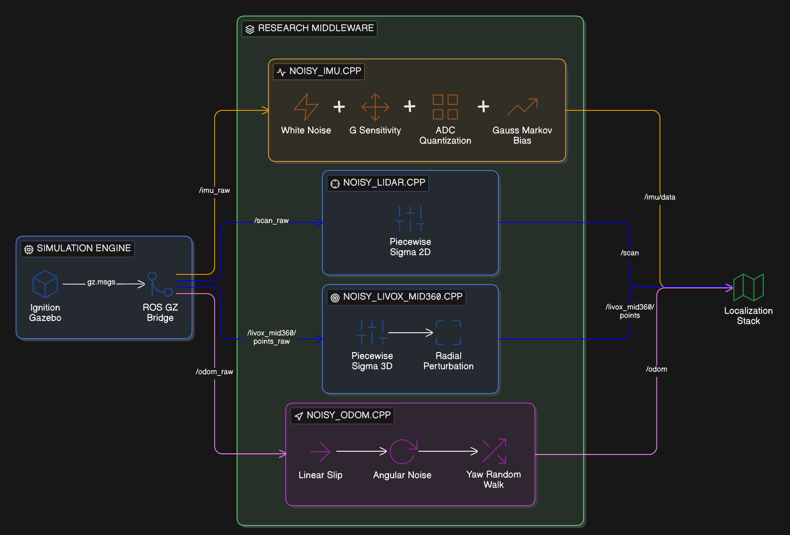

# hospital-agv-sim

[](https://docs.ros.org/en/humble/)
[](https://gazebosim.org/docs/fortress)
[](docs/RESEARCH.md)
[](LICENSE)

ROS 2 / Ignition Gazebo hospital simulation for the AgileX Tracer 2.  
The goal is to make the simulated sensors behave closer to the real hardware, so that localization and SLAM fail in simulation for the same reasons they fail on the robot.

---

## Overview

In early tests with the real Tracer 2 in hospital corridors, localization worked well in ideal simulation but degraded on the real robot. EKF and LiDAR-based SLAM were too optimistic because the simulated sensors had almost no noise or bias.

This package adds:

1. A hospital-scale world with corridors and occlusions.
2. A URDF/xacro model of the Tracer 2 with a consistent TF tree.
3. A C++ noise pipeline: it listens to ideal Gazebo topics and publishes ROS 2 topics with more realistic noise and covariances.

The idea is to tune your localization stack once on realistic simulation and then move to the robot with fewer surprises.

---

## Main features

- Per-sensor noise nodes (IMU, 2D LiDAR, 3D LiDAR, odometry).
- Parameters linked to datasheets where possible (IMU, LiDAR); odometry based on literature plus observation.
- Covariance matrices set so that the EKF trusts each sensor only where it makes sense (odometry heading is treated as weak, for example).
- C++ implementation to keep latency low at 100 Hz+ on embedded hardware.

Details and references are in `docs/RESEARCH.md`.

---

## Design choices

- **Noise layer instead of only retuning SLAM**  
  Instead of over-tuning SLAM around perfect sensors, this repo tries to make the sensor topics themselves more realistic. That way, the same SLAM configuration is closer to usable in both simulation and on-robot tests.

- **C++ instead of Python for the hot path**  
  The first version used Python for the noise nodes. At high sensor rates on a Jetson, this added visible jitter. Moving to C++ removes the interpreter from the critical path.

- **Realism level**  
  IMU and LiDAR models are based on datasheets and standard models. Odometry numbers are estimates in a reasonable range. The target is "good enough to reproduce typical failure modes", not a full calibration of one specific robot.

---

## Architecture

High-level data flow for each sensor:

```text
Gazebo plugin  -->  /gz/topic
                      |
                      v
ros_gz_bridge   -->  /sensor_raw
                      |
                      v
C++ noise node  -->  /sensor
```

- Gazebo publishes ideal data.
- `ros_gz_bridge` exposes it to ROS 2.
- The noise node subscribes to `*_raw`, applies the model, and publishes standard `sensor_msgs` with covariances filled in.

More details, including formulas and covariance entries, are in `docs/architecture.md`.

---

## Tech stack



Comparison of the Livox Mid-360 point cloud in RViz2: **Raw Simulation** (left) vs. **Realistic Noise Model** (right). Note the radial "spreading" of points as distance increases.

<div align="center">
  
</div>

| Component        | Version / notes                                |
|-----------------|-----------------------------------------------|
| ROS 2           | Humble                                        |
| Simulator       | Ignition Gazebo Fortress                      |
| Language        | C++17                                         |
| Tested on       | Ubuntu 22.04, Jetson Orin                     |

---

## Getting started

### Prerequisites

- ROS 2 Humble installed and sourced.
- `colcon` available.
- Ignition Gazebo Fortress working.
- A ROS 2 workspace (for example `~/ros2_ws`).

### Build

```bash
cd ~/ros2_ws/src
git clone https://github.com/Narcis-Abella/hospital-agv-sim.git

cd ..
rosdep install --from-paths src --ignore-src -r -y

colcon build --packages-select hospital-agv-sim
source install/setup.bash
```

### Run

```bash
# Hospital world + Tracer 2 + noise nodes
ros2 launch hospital-agv-sim simulation.launch.py headless:=false
```

Check the launch file for available options.

---

## Repository structure

```text
.
├── CMakeLists.txt      # Build configuration
├── package.xml         # ROS 2 package manifest
├── README.md           # Project overview and usage
├── LICENSE             # MIT license
├── docs/               # Research notes and architecture
│   ├── RESEARCH.md
│   └── architecture.md
├── launch/             # Launch files
├── src/                # C++ noise nodes
├── scripts/            # Legacy Python nodes (kept for reference)
├── urdf/               # Robot and sensor xacros
├── meshes/             # Meshes for the robot and environment
├── models/             # Gazebo models
└── worlds/             # Hospital simulation worlds
```

---

## License

MIT License. See `LICENSE` for details.

---

## Acknowledgements

- Hospital world for the original ROS 1 project by [`javicensaez/tracerSencillo`](https://github.com/javicensaez/tracerSencillo).
- ROS 2 migration, sensor stack and noise nodes by Narcis Abella.

